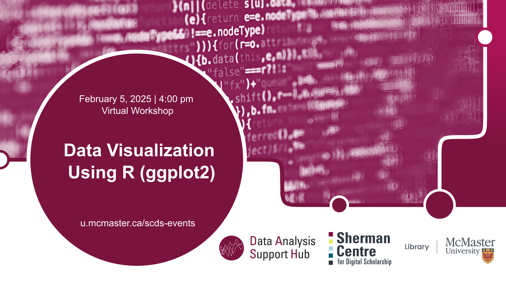

# Data visualization using R (ggplot2)

This **online workshop** covers ggplot2, a data visualization package for R. Participants will learn the basics of the grammar of graphics and how to create various types of informative plots using ggplot2.

[Register for this workshop](https://libcal.mcmaster.ca/calendar/scds/data-vis-r){: .btn .btn-outline }

## Workshop Preparation 

## Facilitator Bio

Sahar Khademioore is a PhD candidate in the Health Research Methodology program at McMaster University with a background in midwifery. She supports researchers in data analysis using statistical software such as R, SAS, and SPSS, research methodology, and evidence synthesis (including systematic reviews).
