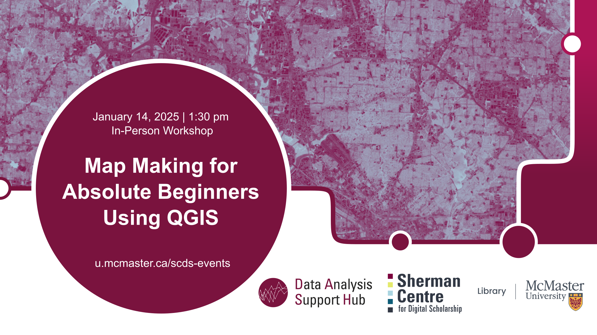

# Visualizing with R gganimate

This **in-person workshop** is designed for those who are curious about making maps but haven't yet had the opportunity to learn. It will provide a friendly introduction to geographic data and the mapping of this data using the geographic information system (GIS) software, [QGIS](https://qgis.org/). Absolutely no geography or quantitative background is necessary for an engaging experience. 

This workshop will provide attendees with the ability to describe geographic data and the basic capabilities of geographic information systems. By completeing the workshop exercise, attendees will become familiar with four basic components of the geographic information systems software, QGIS: (1) the QGIS graphical user interface, (2) geospatial webservices, (3) coordinate reference systerms, and (4) the QGIS print layout tool.

[Register for this workshop](https://libcal.mcmaster.ca/calendar/scds/intro-qgis-2){: .btn .btn-outline }

## Workshop Preparation 

An installed and working version of QGIS version 3.34 (Long-Term Release). Follow instructions provided [here](https://qgis.org/download/) to install on your operating system.

Attendees can arrive 30 minutes before the workshop to get assistance downloading and installing QGIS. 

## Facilitator Bio

Saman’s (she/her) work operates at the intersection of information science and critical geography. She’s particularly interested in the ways in which community-owned and -governed infrastructure can contribute to equitable knowledge systems. Currently, Saman takes care of McMaster’s Lloyd Reeds Map Collection, ensuring community members are able to access, understand, and use the collection for teaching and research.
