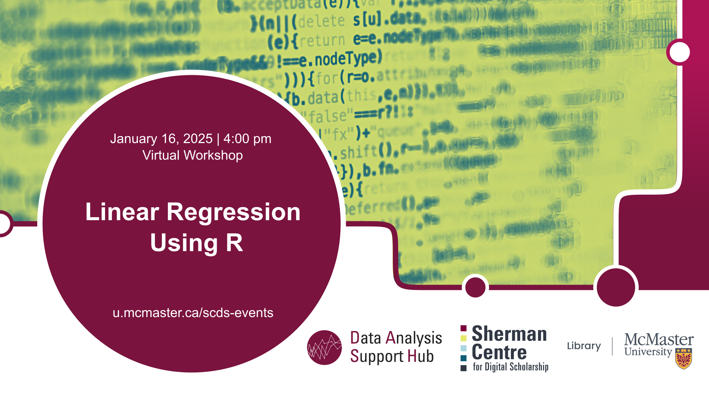

# Linear regression using R

In this **online workshop**, we will explore how to use R for conducting linear regression. We will cover how to fit a linear model, interpret coefficients, assess model assumptions, and evaluate the model's fit using diagnostic tools like residual plots.In this workshop, we will explore how to use R for conducting linear regression. We will cover how to fit a linear model, interpret coefficients, assess model assumptions, and evaluate the model's fit using diagnostic tools like residual plots.

[Register for this workshop](https://libcal.mcmaster.ca/calendar/scds/linear-regression-r){: .btn .btn-outline }

## Workshop Preparation 

## Facilitator Bio

Sahar Khademioore is a PhD candidate in the Health Research Methodology program at McMaster University with a background in midwifery. She supports researchers in data analysis using statistical software such as R, SAS, and SPSS, research methodology, and evidence synthesis (including systematic reviews).
