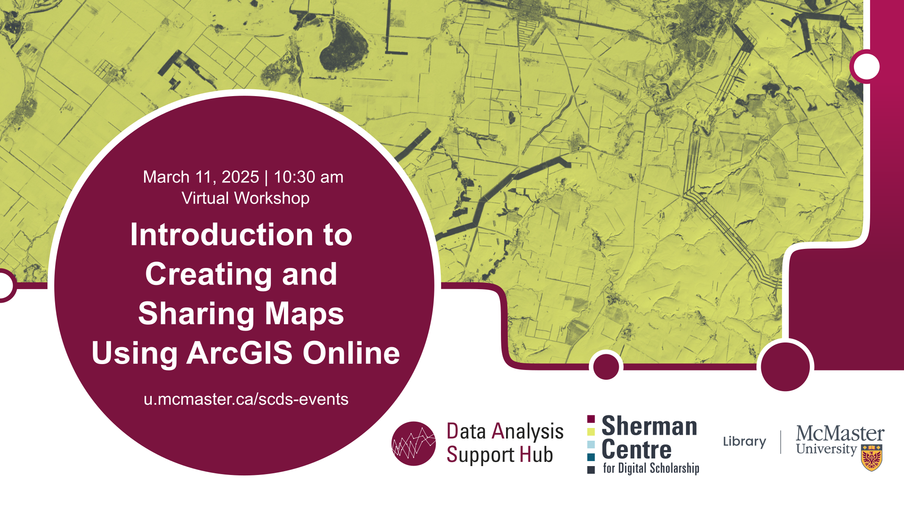

# Introduction to Creating and Sharing Maps Using ArcGIS Online

This beginner-friendly session introduces participants to the core concepts of Geographic Information Systems (GIS) and geospatial data, then shows how to apply these concepts during a hands-on exercise where you will create a web-based map in ArcGIS Online.

By the end of the workshop, participants will be able to: - Explain Geographic Information Systems (GIS) concepts and identify potential applications for GIS
- Locate sources of geospatial data
- Apply the skills learned to author a simple map using ArcGIS Online.

## Workshop Preparation 

To follow along with the workshop, participants will require access to ArcGIS Online. Current McMaster students, staff, and faculty can request a license through the ArcGIS Software Request Form (<https://mcmaster-ca.libwizard.com/f/arcgis>).

## Facilitator Bio

Christine Homuth (she/her) is the Library's GIS Specialist, providing support and resources to students, researchers, and faculty members working with Geographic Information Systems (GIS) and geospatial data.

## Workshop Slides

<embed src="assets/docs/Creating-and-Sharing-Maps-with-ArcGIS-Online.pdf" style="border:none;" width="100%" height="466px">

[Download as PDF.](assets/docs/Creating-and-Sharing-Maps-with-ArcGIS-Online.pdf)
