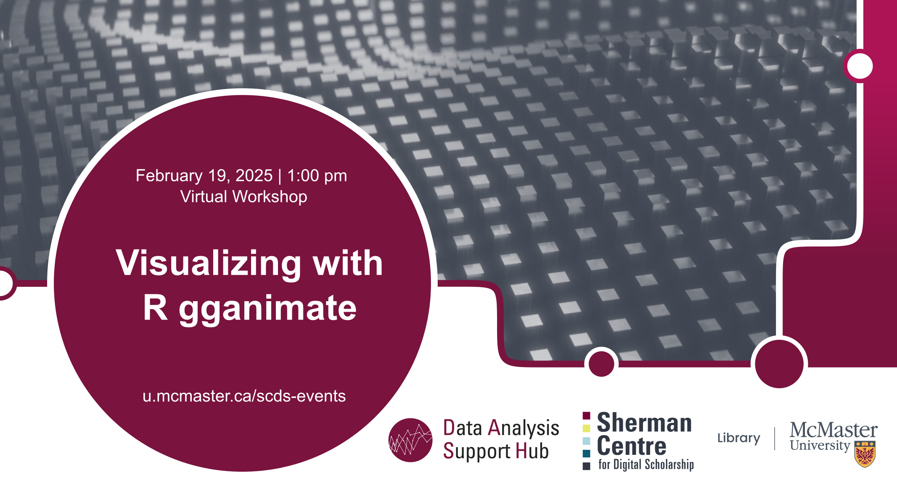

# Visualizing with R gganimate

This virtual workshop will introduce [gganimate](https://gganimate.com/) in the statistical programming language R. This workshop will go examples on how to create visualizations that change over time and how to and customize the design of those graphs. This will build on the previous SCDS workshop [Data Visualization in R using ggplot2](https://learn.scds.ca/dash23-24/ggplot2.html).

[Register for this workshop](https://libcal.mcmaster.ca/calendar/scds/gganimate){: .btn .btn-outline }

## Workshop Preparation 

An installed and working copy of R and R Studio is required on participants' laptops prior to the workshop. Follow instructions provided [here](http://www.rstudio.com/ide/download/desktop).

## Facilitator Bio

Subhanya Sivajothy (she/her) brings a background of research in data justice, science and technology studies, and environmental humanities. She is currently thinking through participatory data design which allow for visualizations that are empowering for the end user.
