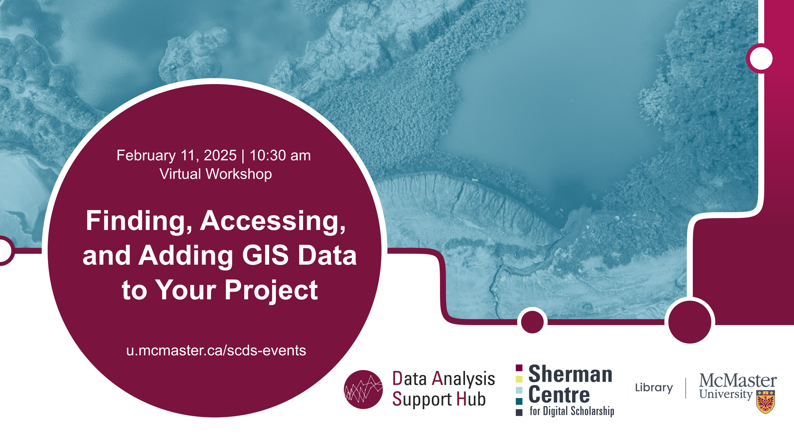

# Finding, Accessing, and Adding GIS Data to Your Project

Geospatial data is data about objects or features on or near the surface of the Earth and can be mapped using Geographic Information Systems (GIS) software. This workshop introduces participants to geospatial data formats as well as sources for this data.

This workshop will teach participants to: differentiate between geospatial data models; locate datasets using common sources for geospatial data; and, evaluate a dataset for use.

[Register for this workshop](.){: .btn .btn-outline }

## Workshop Preparation 

None.

## Facilitator Bio

Christine Homuth (she/her) is the Library's GIS Specialist, providing support and resources to students, researchers, and faculty members working with Geographic Information Systems (GIS) and geospatial data.
