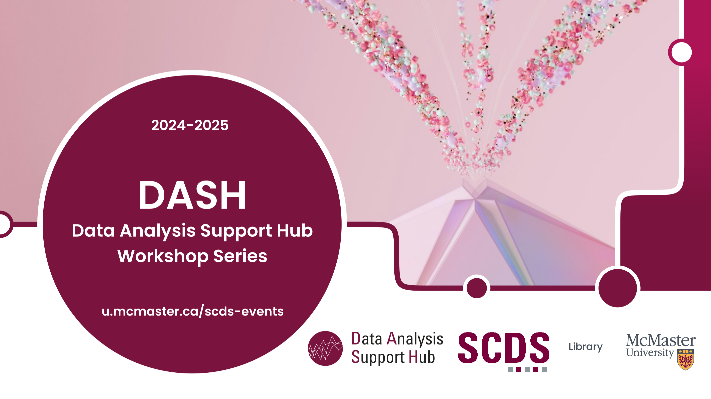



# Welcome to DASH: The Data Analysis Support Hub Webinars

DASH workshops help registrants with data analysis and visualization by providing training for software programs and coding languages including Excel, LaTeX, Python, R, and SPSS.

DASH workshops welcome students, staff, and faculty from any discipline, as well as the public at large. A number of DASH workshops are also geared towards beginners, so even if you’re new to data analysis, we encourage you to sign up and learn!

## 2023-2024 DASH Workshop Topics

  Workshops

<ul>


<li><a href="{{workshop.url | absolute_url}}">{{workshop.title}}</a></li>


</ul>

## Land Acknowledgment


