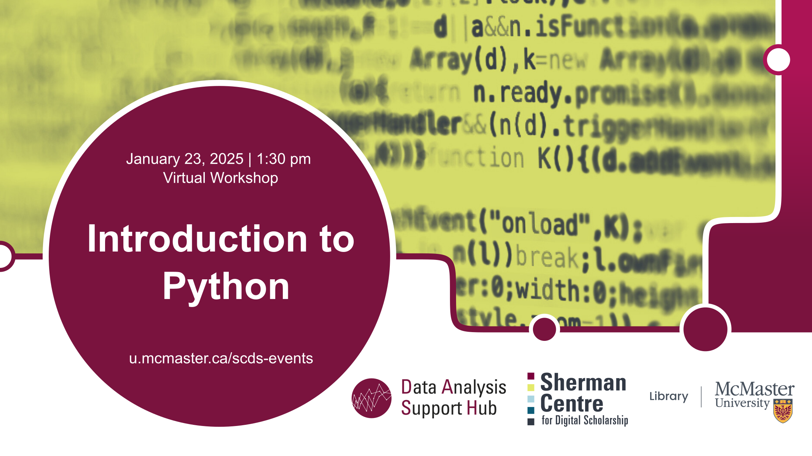

# Intro to Python

This beginner-level workshop will introduce you to the basic concepts of the world’s most popular Python programming language. You’ll learn to store data in Python data types and variables, as well as learn how to perform operations on numbers and strings. No prior knowledge of Python is required. This session will be recorded and made available openly.

## Workshop Preparation 

This workshop will use [Jupyter Notebooks](https://jupyter.org/) for its exercises. 
- McMaster participants (and the facilitator) will use their MAC ID to log in to [syzygy](https://mcmaster.syzygy.ca/), McMaster's Jupiter Notebook instance.
- Non-McMaster participants should be able to use [JupyterLite](https://jupyter.org/try-jupyter/lab/) for the exercises, though the interface and experience may differ slightly from the presentation.

## Facilitator Bio

Vivek Jadon (he/him) provides research support in the use of numeric research data. As part of his role, Vivek is McMaster University’s official representative for Statistics Canada’s Data Liberation Initiative (DLI) program and Inter-university Consortium for Political and Social Research (ICPSR). Both of these programs provide researchers with vast archive of research data from various disciplines for high quality research and instruction. Vivek is also involved in building awareness and promoting RDM activities/services at McMaster.

## Workshop Recording

<iframe height="416" width="100%" allowfullscreen frameborder=0 src="https://echo360.ca/media/c49e10e5-2c26-464d-8d96-334452f53197/public"></iframe>
[View original here.](https://echo360.ca/media/c49e10e5-2c26-464d-8d96-334452f53197/public)
