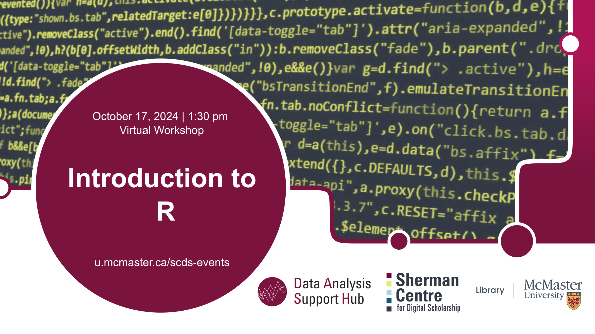

# Introduction to R

This beginner-level workshop will focus on basic concepts of R programming using R Studio. Various Data Types and Data Structures will be discussed as well as basic data manipulation. No prior knowledge of R programming is required for this workshop. This workshop consists of a synchronous workshop session, which will be recorded and shared publicly afterward.

**You can find an asynchronous version of this workshop at** <https://learn.scds.ca/intro-r/>**, and the recording at** <https://learn.scds.ca/intro-r/previousOffering>**.**

## Facilitator Bio

Vivek Jadon (he/him) provides research support in the use of numeric research data. As part of his role, Vivek is McMaster University’s official representative for Statistics Canada’s Data Liberation Initiative (DLI) program and Inter-university Consortium for Political and Social Research (ICPSR). Both of these programs provide researchers with vast archive of research data from various disciplines for high quality research and instruction. Vivek is also involved in building awareness and promoting RDM activities/services at McMaster.
