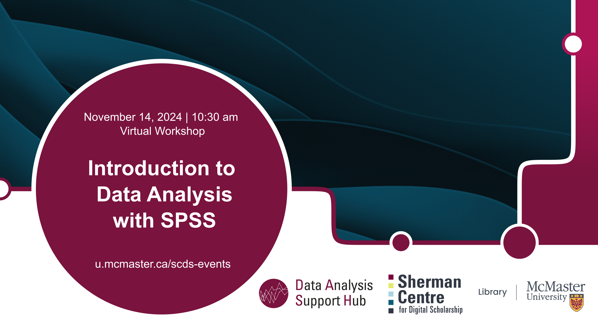

# Introduction to Data Analysis with SPSS

This beginner-level workshop will introduce you to the basics of SPSS statistical software, how it works, and some basic descriptive statistics and statistical procedures. No prior knowledge of SPSS is required. This session will be recorded and made available openly.

**You can find an asynchronous version of this workshop at** <https://scds.github.io/intro-latex/>**, and the recording at** <https://scds.github.io/intro-latex//previousOffering>**.**

## Workshop Preparation 

A working copy (either [trial version](https://www.ibm.com/products/spss-statistics#110) or licensed copy) of SPSS is required on participants' laptops.

## Facilitator Bio

Vivek Jadon (he/him) provides research support in the use of numeric research data. As part of his role, Vivek is McMaster University’s official representative for Statistics Canada’s Data Liberation Initiative (DLI) program and Inter-university Consortium for Political and Social Research (ICPSR). Both of these programs provide researchers with vast archive of research data from various disciplines for high quality research and instruction. Vivek is also involved in building awareness and promoting RDM activities/services at McMaster.