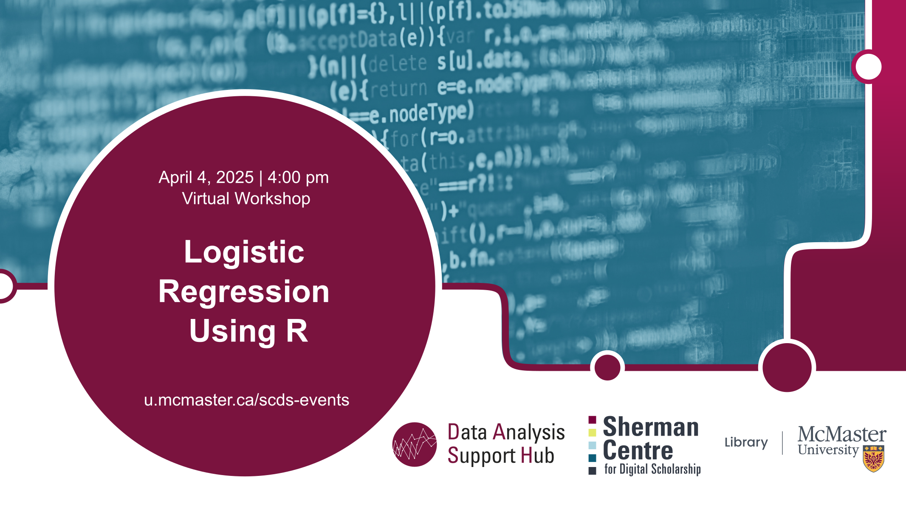

# Logistic regression using R

This **online workshop** will cover the basics of fitting logistic regression models in R. Learning outcomes include: 
- Fitting logistic regression models in R
- Interpreting the odds ratios
- Assessing model fit
- Checking model assumptions

[Register for this workshop](https://libcal.mcmaster.ca/calendar/scds/logistic-regression-r){: .btn .btn-outline }

## Workshop Preparation 
An installed and working copy of R and R Studio is required on participants' laptops prior to the workshop. Follow instructions provided [here](http://www.rstudio.com/ide/download/desktop).

## Facilitator Bio
Sahar Khademioore is a PhD candidate in the Health Research Methodology program at McMaster University with a background in midwifery. She supports researchers in data analysis using statistical software such as R, SAS, and SPSS, research methodology, and evidence synthesis (including systematic reviews).
