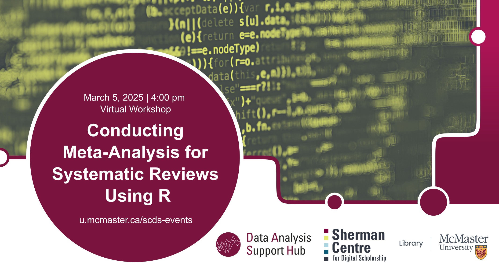

# Conducting meta-analysis for systematic reviews using R

In this **online workshop**, we will focus on learning how to conduct a meta-analysis specifically for systematic reviews of randomized controlled trials (RCTs). This workshop is designed to provide a hands-on experience with using R to efficiently perform the statistical synthesis of evidence. 

[Register for this workshop](https://libcal.mcmaster.ca/calendar/scds/meta-analysis-r){: .btn .btn-outline }

## Workshop Preparation 
An installed and working copy of R and R Studio is required on participants' laptops prior to the workshop. Follow instructions provided [here](http://www.rstudio.com/ide/download/desktop).

## Facilitator Bio

Sahar Khademioore is a PhD candidate in the Health Research Methodology program at McMaster University with a background in midwifery. She supports researchers in data analysis using statistical software such as R, SAS, and SPSS, research methodology, and evidence synthesis (including systematic reviews).
