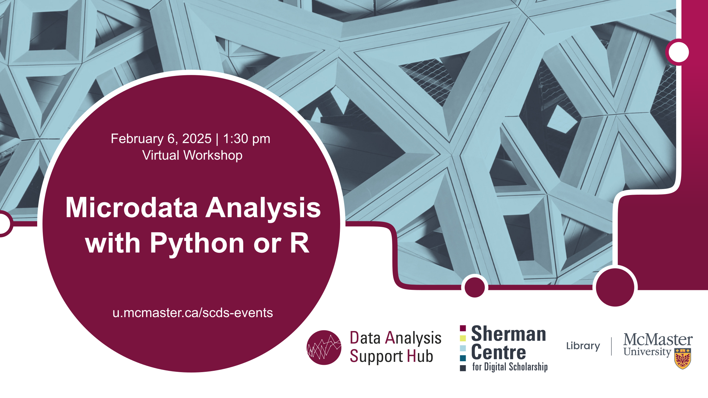

# Microdata Analysis with Python

This hands-on workshop will guide participants through the process of data analysis using the Public Use Microdata File (PUMF) from Statistics Canada’s sample surveys. You will learn how to access, manage, and analyze microdata to extract meaningful insights. Participants will engage with sample datasets, explore various statistical techniques, and gain practical experience in interpreting and presenting their findings. Whether you're a student, researcher, or professional, this workshop will equip you with the tools to effectively analyze and utilize Canadian survey data.

[Register for this workshop](.){: .btn .btn-outline }

## Workshop Preparation 

Participants will use their MacID to login to McMaster's Jupiter Notebook instance.

## Facilitator Bio

Vivek Jadon (he/him) provides research support in the use of numeric research data. As part of his role, Vivek is McMaster University’s official representative for Statistics Canada’s Data Liberation Initiative (DLI) program and Inter-university Consortium for Political and Social Research (ICPSR). Both of these programs provide researchers with vast archive of research data from various disciplines for high quality research and instruction. Vivek is also involved in building awareness and promoting RDM activities/services at McMaster.