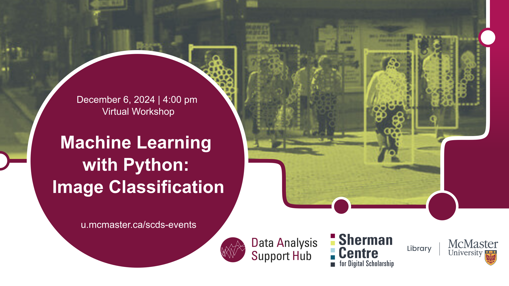

# Machine Learning with Python: Image classification

Learn Image Classification in this **online workshop**, where we delve into image recognition using the PyTorch framework. Whether you're a novice or have some prior experience in machine learning, this workshop is tailored to help you grasp the essentials of building image classification models. Participants will gain an understanding of the fundamentals of image classification and learn data augmentation techniques to enhance model accuracy.

**This workshop was not recorded. However, a previous year's recording and materials for this workshop can be found here: <https://learn.scds.ca/dash23-24/image-classification.html>**

## Workshop Preparation 
Workshop participants will use [Google Colab](https://colab.google/), which requires a Google account. If this poses a challenge, please reach out to the [DASH service](mailto:libdash@mcmaster.ca) for alternative arrangements. 

## Facilitator Bio
Amirreza Mousavi is a master's student in the Electrical and Computer Engineering department at McMaster University. He works as part of the DASH Team, providing data analytics consultations and conducting workshops in various domains of machine learning and programming. Engaged in the intricacies of the artificial intelligence domain, his focus lies in the realms of Computer vision, Statistical analysis and Large language models. He has a strong knowledge of Python and an understanding of other languages such as MATLAB and R. Deliberate and methodical, he approaches programming with a keen eye for detail, striving to develop algorithms that navigate the complexities of the field.
