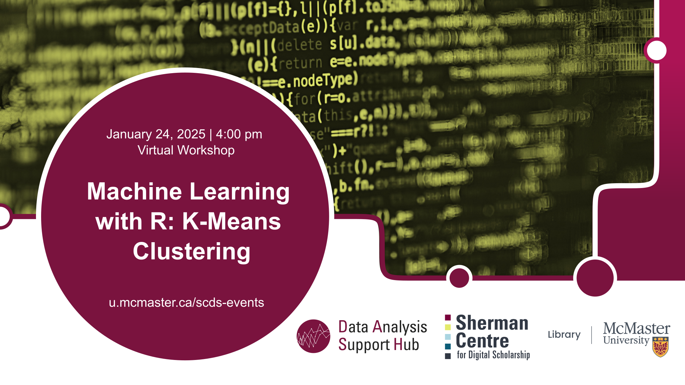

# Machine Learning with R: K-Means Clustering 

This **online workshop** will cover K-Means Clustering, a powerful machine-learning technique used for data segmentation and pattern recognition. K-Means is the most common clustering technique for unsupervised Machine learning. Participants will gain a practical understanding of how to use K-means to group data points, interpret cluster results, and apply clustering techniques to real-world datasets for insights and decision-making.

**This workshop was not recorded. However, a previous year's recording and materials for this workshop can be found here: <https://learn.scds.ca/machine-learning-with-r/k-means.html>**

## Workshop Preparation 
An installed and working copy of R and R Studio is required on participants' laptops prior to the workshop. Follow instructions provided [here](http://www.rstudio.com/ide/download/desktop).

## Facilitator Bio

Amirreza Mousavi is a master's student in the Electrical and Computer Engineering department at McMaster University. He works as part of the DASH Team, providing data analytics consultations and conducting workshops in various domains of machine learning and programming. Engaged in the intricacies of the artificial intelligence domain, his focus lies in the realms of Computer vision, Statistical analysis and Large language models. He has a strong knowledge of Python and an understanding of other languages such as MATLAB and R. Deliberate and methodical, he approaches programming with a keen eye for detail, striving to develop algorithms that navigate the complexities of the field.
