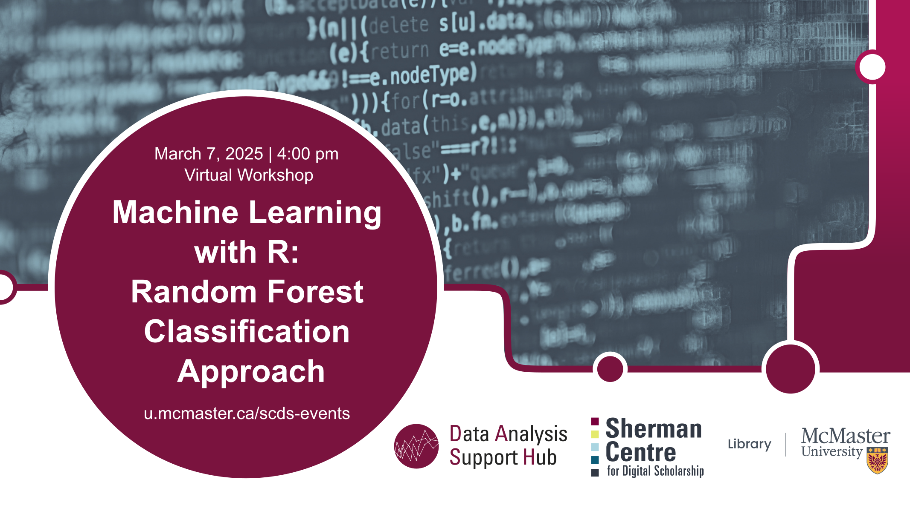

# Machine Learning with R: Random Forest Classification Approach

Join us for an **online workshop** on Random Forest, an ensemble machine-learning technique used for both classification and regression tasks. It is based on the concept of decision trees, where multiple decision trees are trained on different subsets of the data, and their predictions are combined to produce a more accurate and robust final prediction. Some applications of Random Forest Classification are in healthcare for diagnosing diseases based on patient data and in finance for detecting fraud by identifying unusual transaction patterns. It also finds applications in e-commerce for personalized recommendations and in environmental science for classifying land cover types from satellite imagery. 

Through this workshop, participants will learn how to build and interpret Random Forest models, understand feature importance, and apply this ensemble technique to improve prediction accuracy and handle complex datasets effectively.

[Register for this workshop](https://libcal.mcmaster.ca/calendar/scds/ml-random-forest){: .btn .btn-outline }

## Workshop Preparation 
An installed and working copy of R and R Studio is required on participants' laptops prior to the workshop. Follow instructions provided [here](http://www.rstudio.com/ide/download/desktop).

## Facilitator Bio
Amirreza Mousavi is a master's student in the Electrical and Computer Engineering department at McMaster University. He works as part of the DASH Team, providing data analytics consultations and conducting workshops in various domains of machine learning and programming. Engaged in the intricacies of the artificial intelligence domain, his focus lies in the realms of Computer vision, Statistical analysis and Large language models. He has a strong knowledge of Python and an understanding of other languages such as MATLAB and R. Deliberate and methodical, he approaches programming with a keen eye for detail, striving to develop algorithms that navigate the complexities of the field.
