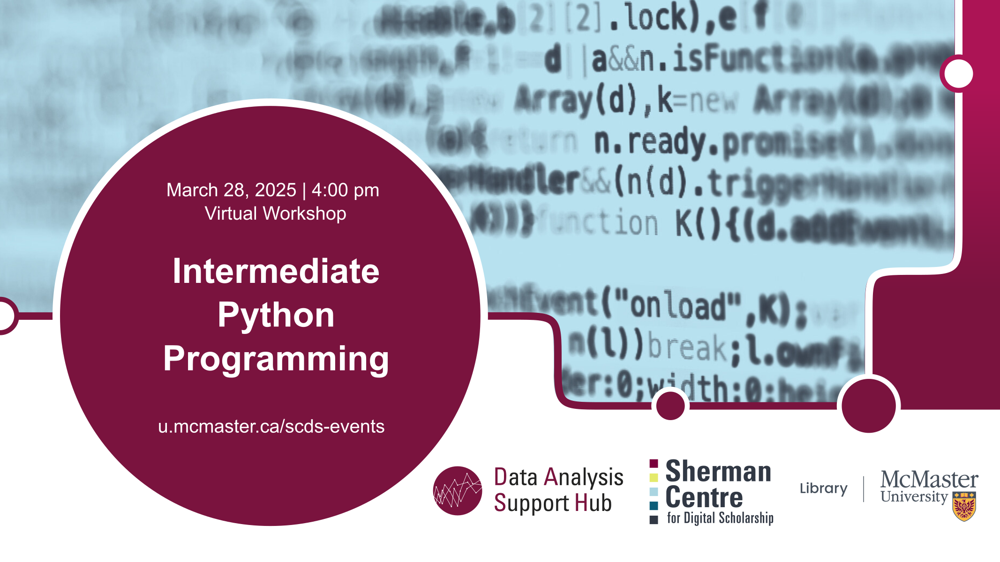

# Intermediate Python programming

Python, a versatile and user-friendly programming language, has found widespread use among scientists for a variety of applications. This **online workshop** will equip participants with foundational skills to use Python effectively in scientific applications. Topics covered include a brief review of variable types, functions, modules, classes, and some of Python’s important science libraries. 

[Register for this workshop](https://libcal.mcmaster.ca/calendar/scds/python-intermediate){: .btn .btn-outline }

## Workshop Preparation 
Workshop participants will use [Google Colab](https://colab.google/), which requires a Google account. If this poses a challenge, please reach out to the [DASH service](mailto:libdash@mcmaster.ca) for alternative arrangements. 

## Facilitator Bio
Amirreza Mousavi is a master's student in the Electrical and Computer Engineering department at McMaster University. He works as part of the DASH Team, providing data analytics consultations and conducting workshops in various domains of machine learning and programming. Engaged in the intricacies of the artificial intelligence domain, his focus lies in the realms of Computer vision, Statistical analysis and Large language models. He has a strong knowledge of Python and an understanding of other languages such as MATLAB and R. Deliberate and methodical, he approaches programming with a keen eye for detail, striving to develop algorithms that navigate the complexities of the field.
